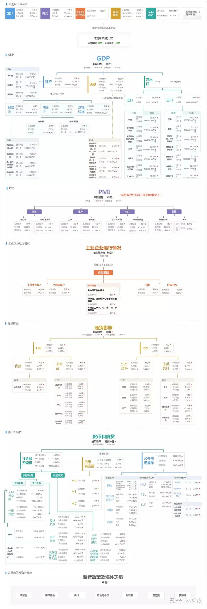

## 定义
### 事件
- 直观描述：对行业或市场会产生重大影响的事件。
- 事件包括`事件触发词`、`事件论元`和`事件属性`
- 默认省略
   - 逆回购操作增加了银行间市场的系统性汇兑风险。
      - 逆回购作为事件触发词，论元省略了央行，因为只有央行才能逆回购。

### 事件论元
事件论元往往是实体：
> 央行 兴业证券 北京大学 王石

### 实体类型 / 标签
- ORG：一般组织
- FIRM：公司
- LIST-FIRM：上市公司
- PRESS：出版社
- MEDIA：媒体
- WEBSITE：网站
- MOVIE：电影
- ENTERTAINMENT：娱乐
- PERSON：人
- ACTOR：演员
- PRODUCER：制片人
- INVENTOR：发明家
- KOL：意见领袖
- ENTREPRENEUR：企业家

一个实体根据其上下文和所在事件论元，可能具有多重标签
> **苹果公司**发布了新的**苹果手机**，导致**鲜苹果期货**大涨，位于**苹果园**出站口果多美的**苹果**也卖的很好

### 事件维度
- 新闻类：国内外宏观经济，资本市场，产业经济，上市公司，产品发布，自然灾害，文化习俗。
- 观点类：股市评论，商业观察，政商名人点评，财经媒体投资人观点，微博大V评论，社交网站评论。

### 事件属性

#### 时间
- 事件时间包含发生时间、结束时间、影响时间。时间以天为单位。
- 金融事件的时间短语按照时间持续时间长短和是否需要网页发布时间可分别分为两类。
   - 直接精确时间短语：描述的时间点可从时间短语本身得到。
   - 直接模糊时间短语：描述的时间段可从时间短语本身得到。
   - 间接精确时间短语：描述的时间点需要基于网页的发布时间方可得到。
   - 间接模糊时间短语：描述的时间段需要基于网页的发布时间方可得到。

## 事件分类
### 政治
- 高层动态
   - 党、深改组、政治局、国务院、人大周期性会议		
   - 高层出访:可按出访区域分		
   - 反腐动向:可按反腐对象的所在领域分，如金融领域、石油领域
- 地缘政治
   - 中美
   - 台海
   - 日韩
   - 欧盟
   - 东南亚
     
### 国内外宏观经济
#### 经济数据

货币
- 社会融资规模
- 货币供应量
   - MO 流通中现金
   - M1 流通中现金 + 企业活期存款
   - M2 流通中现金 + 企业活期存款 + 定期存款 + 居民储蓄存款 + 其他存款
      - 银行
         - 信用投放：贷款，购买企业债券，非标、资管
         - 购买资产：黄金外汇等金融资产，土地房产等实物资产，企业股份
         - 其他：支付收取费用，发股发债派息
      - 政府
         - 财政收支
         - 向非银、居民部门发行或偿还债务
      - 央行
         - 向非银、居民部分再贷款
财政
- 赤字率和总体负债率
- 税收收入
- 非税收收入
- 政府性基金收入
工业
- 工业品出厂价格指数(PPI)
- 采购经理人指数(PMI)
- 工业经济效益
- 规模以上工业增加值
- 失业率
消费
- 社会消费品零售总额
- 居民消费者价格指数(CPI)
其他
- 国内生产总值(GDP)，GDP增长率
- 克强指数（耗电量、铁路货运量和贷款发放量）

#### 政策发布
- 财政政策
   - 财政支出
   - 财政收入
- 货币政策
   - 利率
   - 汇率
   - 存款准备金率
   - 银行间拆借利率
   - 本外币存款
   - 外汇贷款数据
   - 存款基准利率
- 税收政策
   - 全国税收收入
- 投资政策

##### 财政部与央行角色对比

|      | 央行             | 财政部              |
|------|----------------|------------------|
| 政策目标 | 抑制通胀/通缩，刺激经济增长 | 降低失业率，刺激消费       |
| 职权范围 | 货币政策           | 财政政策             |
| 工具   | 之前说过的 + 外汇市场操作 | 基建支出，公共费用支持，收税收费 |

#### 央行政策 Aka. 央妈工具箱
钱 = 货币 + 信用 = 购买力，衡量钱的维度有两个：数量（M2）和价格（利率），央妈的主要任务，就是用工具箱管好钱。工具箱里有「数量型工具」和「价格型工具」。在钱的数量方面，要保证合理的流动性，保证钱的数量匹配生产力增速以及合理通胀（M2=GDP+CPI），不能通缩；要稳定物价；在钱的价格方面，要保持合理的利率水平，让社会有信心有能力负债用于扩大再生产。

- 利率政策：调整所有工具的利率，价格型工具
- 调整存款准备金率：调节货币乘数，从而影响派生货币量
- 再贷款：定向支持，期限小于1年
- 再贴现：帮助商业银行将手里的商业票据贴现
- SLP：公开市场操作（OMO）超短期逆回购<7d，释放流动性
- 正回购：OMO卖出国债，7/14/21/28d，回收流动性
- 逆回购：OMO买入国债，7/14/21/28d，释放流动性
- SLF：常备贷款便利，央行贴现窗口，隔夜，7d，1-3m
- MLF：中期贷款便利，3/6/12m
- PSL：抵押补充贷款，适用于政策性银行
- 收购外汇：收购市场上外汇作为储备，同事将外汇转化为人民币

#### 国内利率体系一览
政策利率
* 短期：OMO SLO SLF TLF
* 中长期：再贷款/贴现 MLF TMLF PSL 央票 国库现金定存
* 存款准备金：法定和超额存款准备金利率
* 存贷款基准利率：LPR 金融机构长短期存贷款基准利率
市场利率
* 货币市场利率
   * 拆借利率 DIBO IBO SHIBOR
   * 票据贴现利率
   * 回购利率 DR FDR R FR OR GC FRGC RC
* 债券市场利率：利率债和信用债发行利率
* 存贷款利率：LDR 实际存贷款利率
* 非标债券利率：资管 融资租赁 保理利率

利率变化会影响资产现值，贴现率越低，「期值」转「现值」打折程度越低。说明「期值」很值钱，那么「现值」理应价格高。低利率会提高资产价格。

#### 理想情况的指标影响
> 投资上升		经济基本面好转	利好股市 利空债市 利好汇率
> 工业增加值上升	经济基本面好转	利好股市 利空债市 利好汇率
> 社会消费品零售总额上升	经济基本面好转	利好股市 利空债市 利好汇率
> 进出口上升		经济基本面好转	利好股市 利空债市 利好汇率
> 社融上升		经济基本面好转	利好股市 利空债市 利好汇率
> 信贷上升		经济基本面好转	利好股市 利空债市 利好汇率
> M2上升			经济基本面好转	利好股市 利空债市 利好汇率
> CPI上升		通胀压力上升	利空债市 利好汇率
> PPI上升		通胀压力上升	股市不定 利空债市 利好汇率
> 官方利率上升	加息，货币政策收紧	利空股市 利空债市 利好汇率
> 官方利率下降	降息，货币政策放松	利好股市 利好债市 利空汇率
> 存贷款准备金上升	回收流动性，货币政策收紧	利空股市 利空债市 利好汇率
> 存贷款准备金下降	释放流动性，货币政策放松	利好股市 利好债市 利空汇率
> 财政政策扩张（积极的）	利好股市
> 财政政策收缩（稳健的）	利空股市

### 资本市场
- 市场类
   - 特定指数在特定几日内下跌x%
      - 指数可包括大盘指数、中小盘指数、特定行业指数等，几日可选1-30日，涨跌幅可选+/-5%
   - 特定指数在特定几日内上涨x%
   - 特定指数在特定几日内成交量在x以上
   - 特定指数在特定几日内成交量在x以下
   - 新股发行与打新相关
      - 做历史事件分析时需注意历史时间段新股规则与当前的差异
   - 增发/再融资
   - 借壳上市
   - 限售解禁
   - 沪港通/深港通
- 监管规则类
   - 发行类，新股发行规则
   - 公司类，退市规则
   - 交易类
      - 交易规则
      - 融资融券规则
      - 税收规则（交易税、印花税）

### 行业
- 行业政策发布
   - 政策类
   - 调控类
   - 行业类
   - 经济热点
- 行业周期
   - 初创期
   - 成长期
   - 成熟期
   - 衰退期
- 产能
- 投资政策
  
### 公司
不定期事件：
- 并购重组
- 停牌
- 业绩预告
- 潜在送股
- 分红预案公告
- ST类盖摘帽
- 知名分析师对公司买卖评级的变化
- 知名分析师对公司盈利预估的调整
- 公司公告
- 管理层持股变化
- 新产品发行
- 管理层变更、生病、死亡、入狱、消失等
- 借壳上市
- 更名
- 配股
- 合股
  
常规周期事件
- 股东大会事件
- 限购股上市事件
- 股权激励事件
- 大股东增持事件
- 次新股
- 高送转除权
- 盈利发布

### 文化
- 节假日（五一劳动节、清明节）
- 习俗度报告披露

### 舆情热点
- 话题名称
- 关联人物
- 关联产品/服务名称
- 关联公司
- 所属行业
- 热度/浏览量
- 点赞数
- 转发/大V转发

### 自然灾害
- 自然灾害
   - 地震
   - 飓风
   - 洪水
   - 火灾
- 传染病
   - SARS
   - 埃博拉
   - 新冠
- 人为事故
   - 航班失事
   - 铁路事故
   - 海运事故
   - 原油泄漏
- 其他
   - 雾霾

### KOL言论

## 宏观经济运行状态

GDP
- 平时常见的「经济三驾马车」—投资、消费、出口，出口对外赚外汇，投资和消费则拉动内需。
- 三驾马车中，投资的累计值远大于消费，说明我们目前的增长主动力还是靠投资。
- 三驾马车拉动GDP增长是一种追求增加产出的思维。在这种引导下，对GDP增速一直有执念。
- 但增加产出并不意味着全部，它仅说明以货币为单位的生产总值在增加。并不能反应个体财富（财富=个体需求的满足）是否增加，不能反应资源是否有效配置（不然为什么要供给侧改革？），不能反应生产和消费结构是否优化，不能反应财富分配的效率与公平。
- 如果未来能够扭转成依靠「消费」来拉升，哪怕GDP增速不高，但增长的质量和可持续性还是有保障的。因为市场才是决定财富持续稳定增长的关键因素。另外，以制造业、房地产- 和基础设施为主的「固定资产投资」高达79%。其中房地产这个拉动经济增长的夜壶，占比为18%；制造业占比35%；基础设施占比25%；

PMI & 工业企业运行状况
- PMI（采购经理指数）的调查方法简单有效，国家统计局每个月都会发布一次，早于其他经济指标，所以是一个具有风向标性质的先行指标。
- PMI由需求、生产、库存和价格四个部分组成。50%是PMI指数的荣枯线。
  
通货膨胀
- CPI，反映家庭购买商品和服务价格变动的宏观指标。因为统计复杂，这是一个滞后性数据。
- PPI，反映企业生产成本的变动。PPI是生产端的成本变化，加上房租、渠道等运营成本，传导给CPI消费端的成本变化。两者结合起来，可以比较直观地反映通货膨胀水平，下个部分要介绍的货币政策也会很大程度上参考它。

货币和信贷
- 货币和信贷，个人财富最直观的体现。
- 央妈是印钱的，控制市场上的「货币」与「信贷」数量，并维持市场流动性。有多少货币目标，就得有多少货币政策工具。央妈都有哪些工具？可以看上面的文章。

监管政策及海外环境
- 最后这部分就是介绍一下影响宏观经济的主要单位：
   - 证监会：管股市的，也是很多投资人的初恋收割机；
   - 银保监会：管银行和保险的。
   - 央行：上文介绍过了，主要就是印钱，制定货币政策，调节流动性；
   - 政治局会议：经济方面的高规格定调吹风会，需要关注；
   - 财政部和国务院：最大的买卖方
   - 美联储：最大的对手方
参考：
- [老钱日日谈在知乎上的分享](https://www.zhihu.com/question/25988863/answer/539167222)
